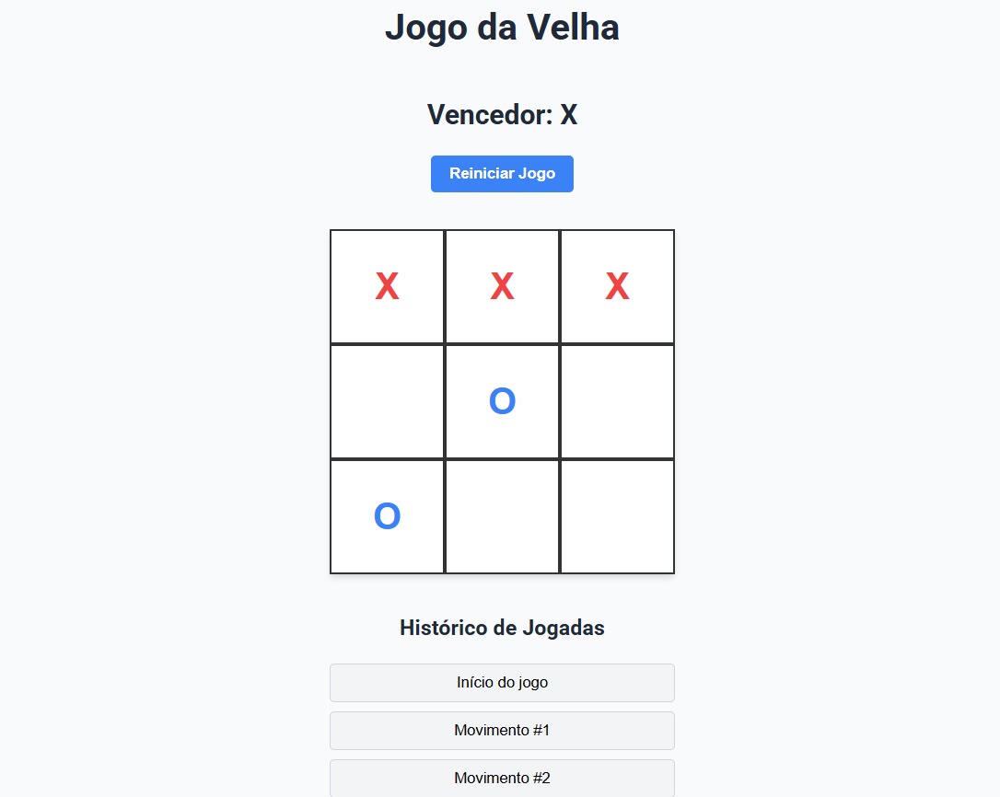

# Angular Tic Tac Toe

<div align="center">
  
  
  
  
</div>

<div align="center">
  
</div>

## 🎮 About the Project

A modern Tic Tac Toe game built with Angular 19. This project demonstrates Angular best practices, including standalone components, reactive state management, and scalable architecture.

### ✨ Features

- 🎲 Complete Tic Tac Toe game with win and draw detection
- 📜 Move history with time travel functionality
- 🎯 Current player turn indication (X or O)
- 🔄 Game reset functionality
- 📱 Responsive design
- 🚀 Standalone component architecture (Angular 19+)
- ⚡ OnPush Change Detection for better performance

## 🛠️ Technologies Used

- **Angular 19.1.0**: Modern frontend framework with standalone component support
- **TypeScript 5.7.2**: Strongly typed language built on JavaScript
- **RxJS 7.8.0**: Reactive programming library with observables
- **SCSS**: CSS preprocessor for advanced styling

## 🚀 Installation and Setup

### Prerequisites

- Node.js (v18 or higher)
- npm (v8 or higher)
- Angular CLI (v19 or higher)

### Setting up the environment

1. **Clone the repository**

```bash
git clone https://github.com/your-username/angular-tic-tac-toe.git
cd angular-tic-tac-toe
```

2. **Install dependencies**

```bash
npm install
```

3. **Run the app in development mode**

```bash
ng serve
```

4. **Access the application**

Open your browser and navigate to `http://localhost:4200`

## 🏗️ Project Structure

```
src/
├── app/
│   ├── components/
│   │   ├── board/           # Board component
│   │   ├── square/          # Individual square component
│   │   └── history/         # Move history component
│   ├── models/
│   │   └── game.model.ts    # Game interfaces and types
│   ├── services/
│   │   └── game.service.ts  # Game state management service
│   ├── app.component.ts     # Root component
│   └── ...
├── assets/
├── styles.scss              # Global styles
└── ...
```

## 📚 Architecture and Patterns

This project implements:

- **Unidirectional Data Flow**: Game state flows from service to components
- **Reactive State Management**: Using RxJS BehaviorSubject to control state changes
- **Standalone Components**: Utilizing Angular's modern approach without NgModules
- **OnPush Strategy**: For optimized change detection
- **Responsive Design**: Adaptable layout for different screen sizes

## 🧪 Testing

Run unit tests with:

```bash
ng test
```

## 📈 Potential Future Enhancements

- Implement scoreboard for multiple matches
- AI opponent with varying difficulty levels
- Light/dark theme support
- Local storage to resume games between sessions
- Online mode to play with friends

## 📝 License

This project is licensed under the [MIT License](LICENSE).

## 👤 Author

Made with ❤️ as part of my development portfolio.

---

<div align="center">
  <sub>Built with Angular 19 • Developed to showcase best practices</sub>
</div>